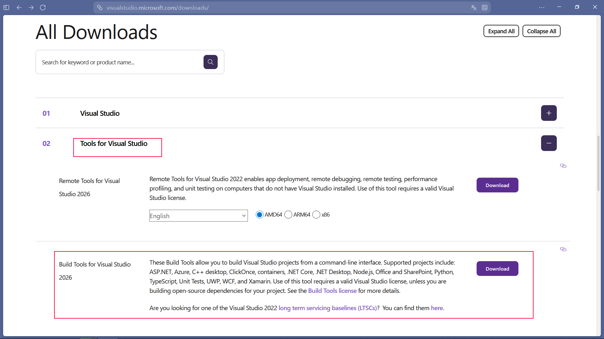

# version: c++ 23

# now in development is only run in windows with msvc

# after will add cross platform and multiple compiler support

1. use this tool to run project simple

https://github.com/WBhlietue/seewkRunner

2. install tools (cmake, ninja, vcpkg), you need install MSVC 2022+ manually

if you never install MSVC before, use following step to install.

goto `https://visualstudio.microsoft.com/downloads/`



download this.

Thene select C++ desktop and uncheck install vcpkg in sidebar

### this command will automatly install these other tools.

```
seewkInit
```

3. install dependency is automat install when using `seewk make`
4. make and run

```
seewk make
```

```
seewk start
```

# Or you can use npm to run project

for example

```
npm run make // make
npm start // compile and run
npm run dev // using nodemom to auto compile and run when cpp file changed
npm run compile // compile project
npm run view // run exe file
```

## used tools:

-   msvc 2022+
-   cmake
-   vcpkg
-   ninja

# if intellisense of modules not working

add following code to your .vscode/c_cpp_properties.json files

```
{
  "configurations": [
    {
      "name": "Win32",
      "intelliSenseMode": "msvc-x64",
      "includePath": [
        "${workspaceFolder}/**"
      ],
      "defines": [],
    "compileCommands": "${workspaceFolder}/build/compile_commands.json",
      "cStandard": "c17",
      "cppStandard": "c++20"
    }
  ],
  "version": 4
}
```

then use `seewk make` and `seewk start` to generate ifc files to use intellisense.
